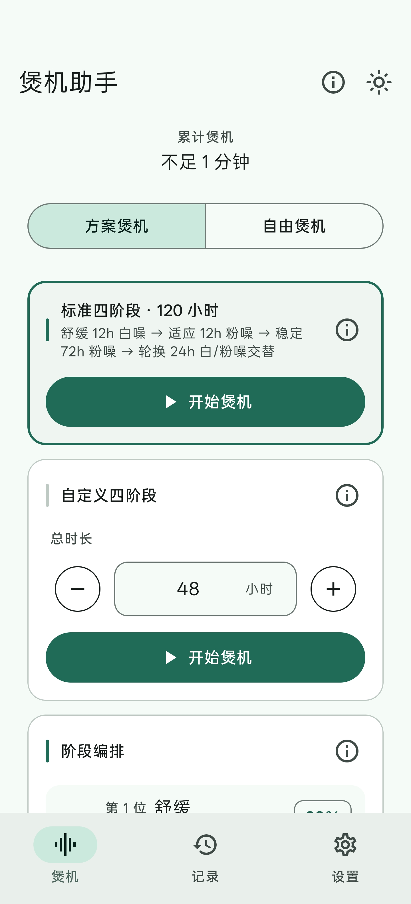
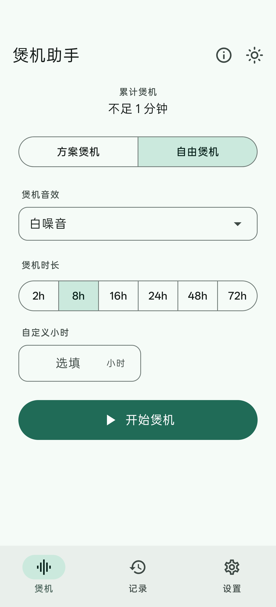
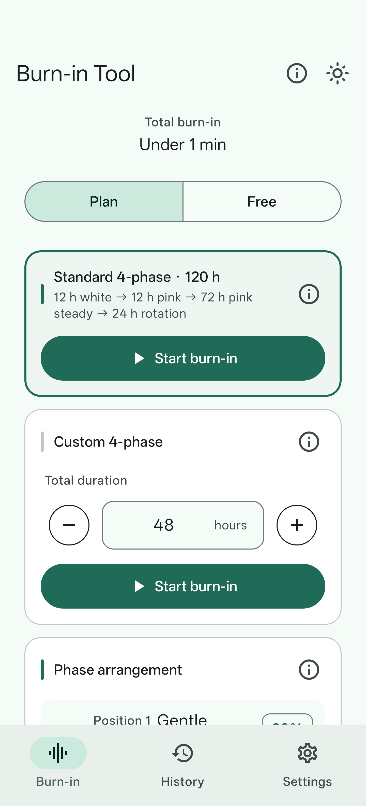
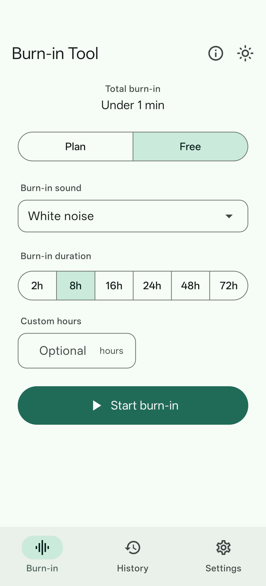

<p align="center">
  
</p>

<h1 align="center">煲机助手 · Burn-in Tool</h1>

<p align="center">
  安卓耳机煲机工具。播放噪声、扫频或你导入的音乐，帮新耳机的振膜更快进入稳定状态；除检查更新和下载更新包时会匿名访问 GitHub 公开页面外，全程离线，不需要账号，免费开源。
</p>

<p align="center">
  <a href="LICENSE"></a>
  
  
</p>

<p align="center"><b>简体中文</b> · <a href="README_EN.md">English</a></p>

---

## 界面预览

| 方案煲机 | 自由煲机 |
| :---: | :---: |
|  |  |
|  |  |

<p align="center"><sub>上排为简体中文界面，下排为英文界面；左列为方案煲机，右列为自由煲机。</sub></p>

## 功能与使用

煲机助手提供方案煲机和自由煲机两条路线。方案煲机按四阶段固定顺序走完一次长时间煲机；自由煲机自己选音源和时长，随时可停。音源既可以用内置的合成音源，也可以导入本地音乐，播放进度会被记录下来，应用退到后台仍继续煲机。

各功能的具体用法、参数细节和常见问题，见使用手册：[docs/MANUAL.md](docs/MANUAL.md)。英文版手册见 [docs/MANUAL_EN.md](docs/MANUAL_EN.md)。

## 技术栈

- Kotlin + Jetpack Compose（Material 3）
- Room（进度持久化）+ DataStore（偏好设置）
- 前台服务 + 通知媒体控制
- 最低支持 Android 8.0（minSdk 26），target/compileSdk 36，JVM 目标 17

## 构建方法

环境要求：JDK 17、Android SDK（API 36）。

1. JDK 17 默认读取 `JAVA_HOME` 环境变量，也可以在项目根目录的 `gradle.properties` 中指定：
   ```properties
   org.gradle.java.home=path/to/jdk-17
   ```
2. Android SDK 路径写在项目根目录的 `local.properties`（已被 gitignore）中：
   ```properties
   sdk.dir=path/to/android-sdk
   ```
   用 Android Studio 打开项目会自动生成该文件。
3. 构建：
   ```bash
   ./gradlew assembleDebug        # Debug 包（armeabi-v7a、arm64-v8a 各一）
   ./gradlew assembleRelease      # Release 包（minify + 资源收缩，按 ABI 分包）
   ./gradlew :app:testDebugUnitTest  # 单元测试
   ```
4. Release 签名是可选的。在项目根目录放置 `key.properties` 与签名文件：
   ```properties
   storePassword=...
   keyPassword=...
   keyAlias=...
   storeFile=path/to/keystore.jks
   ```
   没有 `key.properties` 时构建不会失败，Release 以未签名形式产出。

仓库在 `settings.gradle.kts` 中前置了阿里云 Maven 镜像以缓解国内网络抖动，仅在本地构建时前置，CI 环境直接用官方源；本地镜像不可达时也会回退到 google 与 mavenCentral。

## 打包产物与发布

APK 按 ABI 分包，分为 `armeabi-v7a` 与 `arm64-v8a`，没有 universal 包，产物统一命名为：

```
open-burnin-tool-v<版本号>-<abi>-<debug|release>.apk
```

例如 `open-burnin-tool-v1.5.0-arm64-v8a-release.apk`、`open-burnin-tool-v1.5.0-armeabi-v7a-debug.apk`。

发布是手动流程，没有自动发布 workflow：

1. 递增 `app/build.gradle.kts` 顶部的 `appVersionName`，并递增 `defaultConfig` 的 `versionCode`；
2. 执行 `./gradlew assembleRelease`，产物在 `app/build/outputs/apk/release/`；
3. 在 GitHub 创建与 `appVersionName` 同名的 `v<版本号>` Release，上传两个 ABI 的 release APK 作为资产。

应用内更新会匿名抓取 GitHub 公开 Release 页面，不走 GitHub API，也不需要 token，下载时按设备 ABI 匹配资产。因此发布时必须满足以下几点：

- Release 标签与 `appVersionName` 一致。应用按资产名中的 `-v<版本号>-` 匹配，版本号不一致会匹配不到，并提示「发现新版本 x.y.z，但未找到适用于当前设备架构的安装包」。
- 资产名保持 `open-burnin-tool-v<版本号>-<abi>-release.apk` 不变。匹配还依赖其中的 `-release` 与 ABI 片段。
- `versionCode` 必须递增，否则系统安装器拒绝覆盖安装。
- 使用与应用已装版本相同的签名密钥构建，否则安装器报签名冲突。

现有 CI `.github/workflows/build-apk.yml`（push 到 main 触发）只上传 Actions Artifact，不创建 Release。

## 目录结构

```
app/src/main/java/com/github/gbandszxc/obt/
├── data/       # Room 持久化、仓库与设置
├── domain/     # 煲机方案与进度逻辑
├── locale/     # 应用内多语言（进程级语言状态与 Context 包装，AppLocale.kt）
├── playback/   # 前台服务、合成音源播放器、播放控制
├── update/     # 应用内更新（检查、下载、安装）
└── ui/         # Compose 界面（煲机、记录、设置、主题；更新弹窗在 ui/update/）
docs/           # 产品定义、设计系统与使用手册（PRODUCT.md、DESIGN.md、MANUAL.md）
docs/screenshots/  # README 界面截图
```

## License

[MIT](LICENSE)
